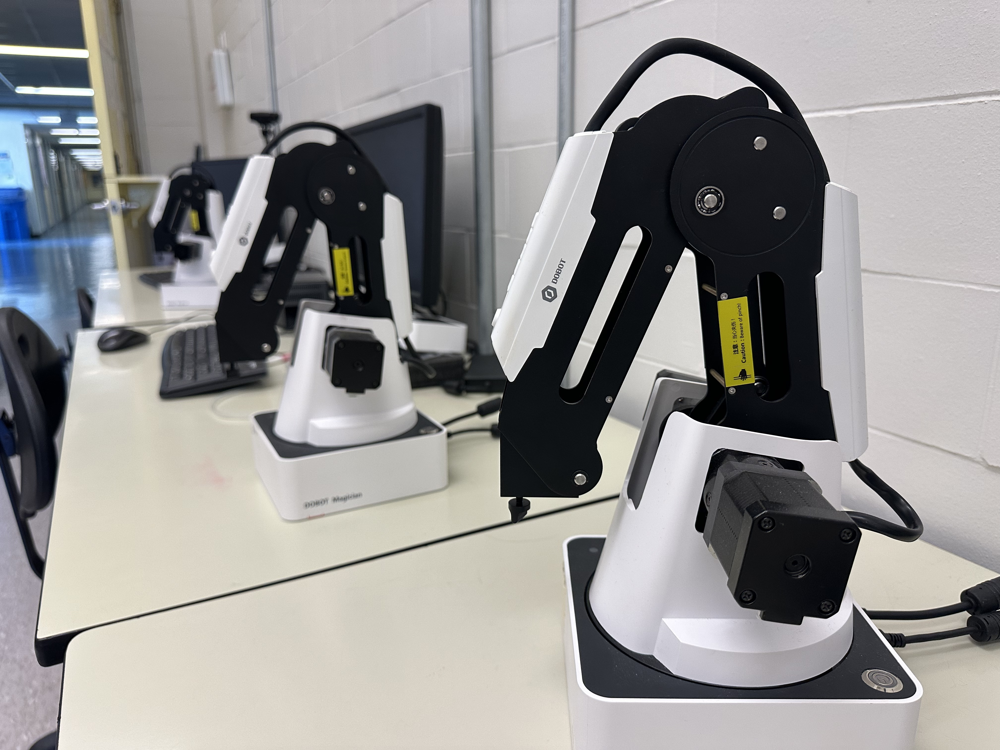
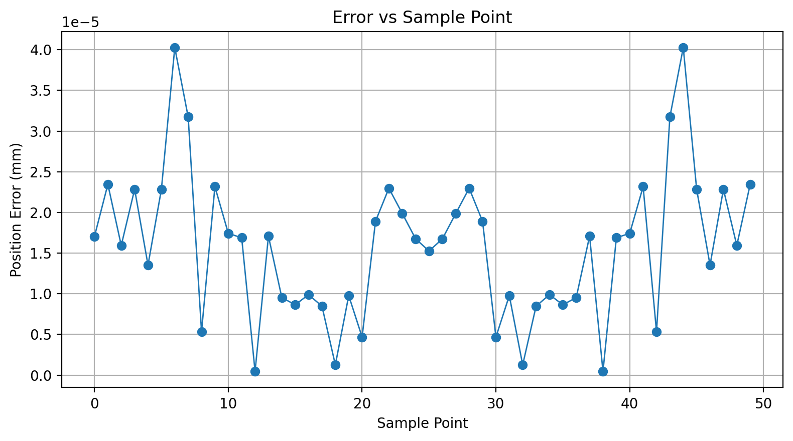
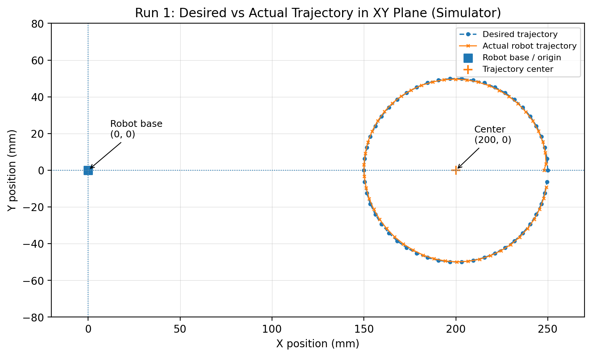
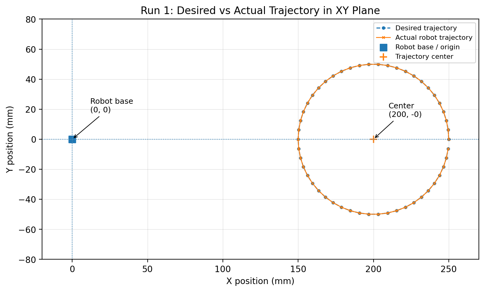
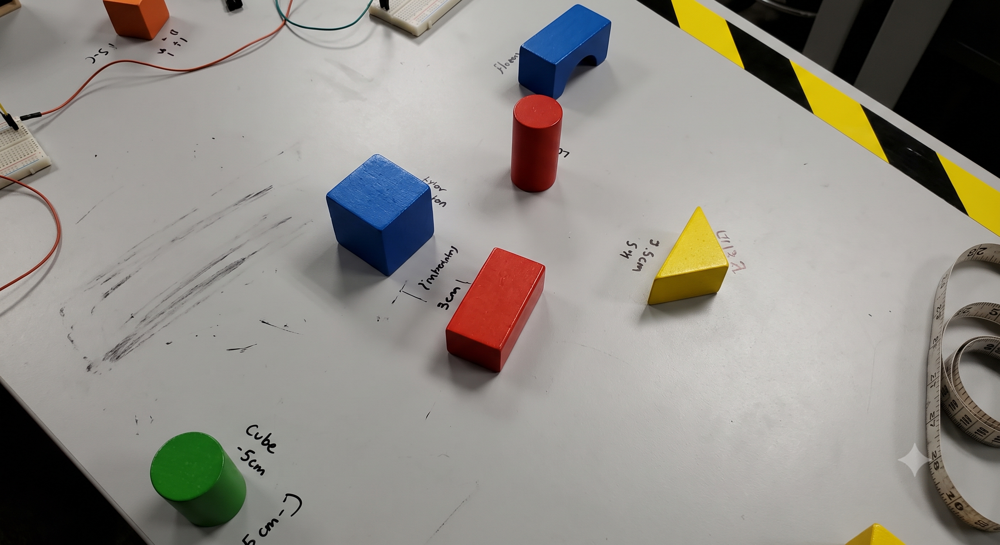
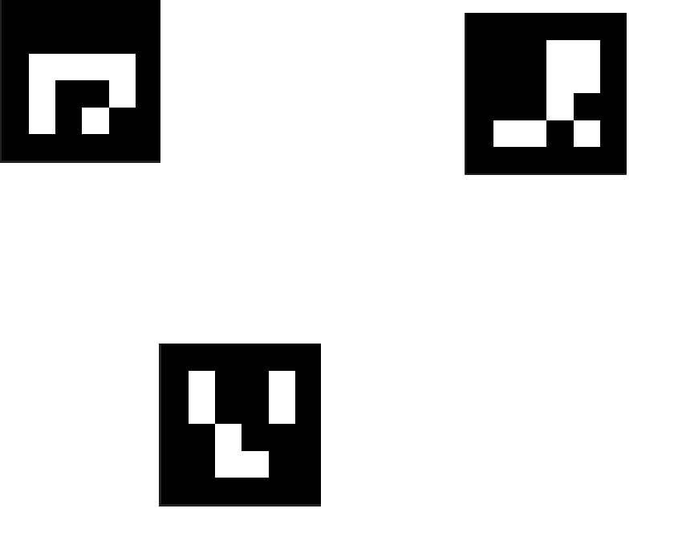
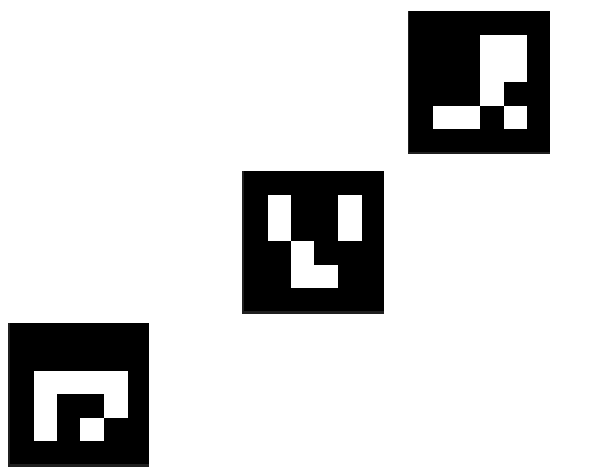
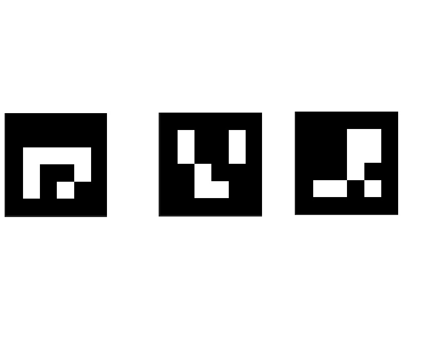

# Vision-Guided Robotic Manipulator

A robotics project integrating **kinematics, trajectory planning, computer vision, coordinate transformation, and autonomous manipulation** using the Dobot Magician robotic platform.

<p align="center">
  
</p>

<p align="center">
  <em>Dobot Magician robotic platform used for system development and experimental validation.</em>
</p>

The system was progressively developed from fundamental robot motion and workspace validation to a complete vision-guided pick-and-place pipeline capable of detecting objects, transforming visual coordinates into the robot frame, and autonomously manipulating objects using a suction-cup end effector.

## System Overview

The project follows the complete development pipeline:

**Workspace Validation & Trajectory Planning**  
↓  
**Forward Kinematics**  
↓  
**Inverse Kinematics**  
↓  
**Camera-to-Robot Transformation**  
↓  
**Vision-Based Motion**  
↓  
**Autonomous Pick-and-Place**

The final system combines robot kinematics and computer vision to identify objects in the camera image, determine their positions in the robot coordinate frame, and execute autonomous manipulation tasks.

---

## 1. Workspace Validation & Trajectory Planning

The first stage establishes safe robot motion within the Dobot Magician workspace.

Implemented functionality includes:

- Cartesian workspace validation
- Straight-line path sampling and collision-aware workspace checking
- Safe robot movement commands
- Circular Cartesian trajectory generation
- Target and measured position recording
- Trajectory tracking error analysis
- Simulation and physical robot validation

### Trajectory Tracking

<p align="center">
  
</p>

### Simulation and Physical Robot Tests

| Simulation | Physical Robot |
|---|---|
|  |  |

[Source Code](lab1-workspace-trajectory/src/workspace_trajectory.py) · [Experimental Results](lab1-workspace-trajectory/results/trajectory_results.csv) · [Report](lab1-workspace-trajectory/report/lab1_report.pdf)

---

## 2. Forward Kinematics

A forward kinematics model was developed to calculate the Cartesian position of the robot end effector from its joint configuration.

The implementation includes:

- Joint-space representation of the Dobot Magician
- Analytical forward kinematics
- End-effector position calculation
- Validation using experimental robot data
- Comparison between predicted and measured positions

The model provides the mathematical foundation required for later inverse kinematics and vision-based control.

[Source Code](lab2-forward-kinematics/src/forward_kinematics.py) · [Validation Data](lab2-forward-kinematics/data/fk_validation_data.txt) · [Report](lab2-forward-kinematics/report/lab2_report.pdf)

---

## 3. Inverse Kinematics & Coordinate Transformation

The system was extended with inverse kinematics to convert desired Cartesian positions into robot joint configurations.

Implemented functionality includes:

- Analytical inverse kinematics
- Cartesian-to-joint-space conversion
- Inverse kinematics validation
- Camera-to-robot coordinate transformation
- Experimental transformation validation

The coordinate transformation enables positions observed by the camera to be represented in the robot coordinate system, forming the connection between computer vision and robot control.

[Source Code](lab3-inverse-kinematics/src/inverse_kinematics.py) · [Transformation Results](lab3-inverse-kinematics/data/transformation_validation.csv) · [Report](lab3-inverse-kinematics/report/lab3_report.pdf)

---

## 4. Vision-Guided Robot Motion

Computer vision was integrated with the robot control pipeline to enable movement based on visual targets.

The system incorporates:

- Camera calibration
- ArUco marker detection
- Camera-to-robot coordinate mapping
- Vision-restricted workspace validation
- Visual target localization
- Robot positioning based on detected markers
- Physical robot validation

[Source Code](lab4-vision-based-motion/src/vision_based_motion.py) · [Experimental Results](lab4-vision-based-motion/results/vision_motion_results.csv) · [Report](lab4-vision-based-motion/report/lab4_report.pdf)

---

## 5. Autonomous Vision-Based Pick-and-Place

The final stage integrates the previous components into an autonomous object manipulation system.

Objects are detected using image processing, transformed from image coordinates into the robot coordinate frame, and moved to a target location using a suction-cup end effector.

The manipulation pipeline includes:

1. Capture the workspace using the camera
2. Detect objects using HSV-based segmentation
3. Filter detected contours
4. Determine object center positions
5. Transform image coordinates into robot coordinates
6. Detect the target ArUco marker
7. Move the robot to the detected object
8. Activate the suction-cup end effector
9. Move the object to the target location
10. Release the object and repeat the process

### Vision Detection

<p align="center">
  
</p>

### Multi-Object Detection

<p align="center">
  
</p>

### Vision Validation Tests

| Test 1 | Test 2 |
|---|---|
|  |  |

[Source Code](lab5-vision-pick-and-place/src/vision_pick_and_place.py) · [Report](lab5-vision-pick-and-place/report/lab5_report.pdf)

---

## Technologies

- Python
- NumPy
- OpenCV
- MuJoCo
- Dobot Magician
- ArUco Markers
- Computer Vision
- Forward & Inverse Kinematics
- Coordinate Transformations
- Trajectory Planning
- Autonomous Manipulation

---

## Repository Structure

```text
Vision-Guided-Robotic-Manipulator/
│
├── assets/
│   └── dobot_magician.jpg
│
├── lab1-workspace-trajectory/
│   ├── src/
│   ├── results/
│   └── report/
│
├── lab2-forward-kinematics/
│   ├── src/
│   ├── data/
│   └── report/
│
├── lab3-inverse-kinematics/
│   ├── src/
│   ├── data/
│   └── report/
│
├── lab4-vision-based-motion/
│   ├── src/
│   ├── results/
│   └── report/
│
├── lab5-vision-pick-and-place/
│   ├── src/
│   ├── results/
│   └── report/
│
├── .gitignore
└── README.md
```

---

## Project Background

This project was developed through ECE 486 laboratory work at the University of Waterloo using the Dobot Magician robotic platform.

Course-provided starter code, robot interfaces, and simulation infrastructure were used as the foundation for portions of the laboratory environment. The repository presents the implemented algorithms, experimental logic, validation procedures, and project-specific development completed throughout the project.

---

## Author

**Hanhua Ge**  
University of Waterloo